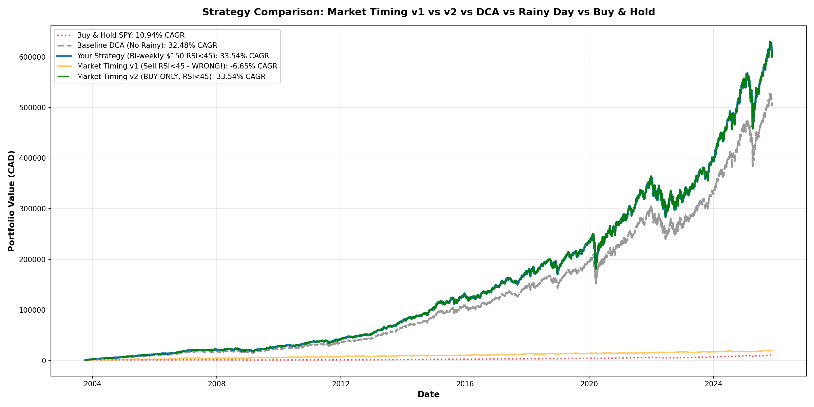

# Market Timing Strategy Comparison

## The Question

**Does trying to time the market beat a disciplined DCA + Rainy Day strategy?**

---

## The 4 Strategies Tested

### 1. Buy & Hold SPY (Baseline Market)
- **What:** Invest $1,000 on day 1, never touch it
- **CAGR:** 10.94%
- **Final Value:** $9,936
- **Total Invested:** $1,000

### 2. Baseline DCA (Simple Dollar-Cost Averaging)
- **What:** Invest $150 bi-weekly, save $30 bi-weekly (no rainy day buying)
- **CAGR:** 32.48%
- **Final Value:** $503,343
- **Total Invested:** $87,550

### 3. Your Strategy (Rainy Day DCA)
- **What:** Invest $150 bi-weekly + extra $150 when RSI < 45
- **CAGR:** 33.54%
- **Final Value:** $600,907
- **Total Invested:** $104,350
- **Improvement over DCA:** +1.07% CAGR, +$97,624 wealth

### 4. Market Timing (Sell 50% on Dips)
- **What:** 
  - Start with bi-weekly $150 DCA
  - When RSI < 45: **SELL 50% of position**
  - DCA back weekly with proceeds during rainy period
  - Repeat for every RSI dip
- **CAGR:** **-6.65%** ⚠️
- **Final Value:** **$19,096**
- **Total Invested:** $87,550
- **Sell Transactions:** 254 times over 22 years

---

## Results Summary

| Strategy | CAGR | Final Value | vs Market | vs DCA | vs Your Strategy |
|----------|------|-------------|-----------|--------|------------------|
| **Your Strategy** | **33.54%** | **$600,907** | **+22.60%** | **+1.07%** | **Baseline** |
| Baseline DCA | 32.48% | $503,343 | +21.54% | Baseline | -1.07% |
| Buy & Hold SPY | 10.94% | $9,936 | Baseline | -21.54% | -22.60% |
| **Market Timing** | **-6.65%** | **$19,096** | **-17.59%** | **-39.13%** | **-40.19%** |

---

## The Shocking Truth About Market Timing

### Why Market Timing Failed So Badly

1. **Sold at the bottom, bought on the way up**
   - RSI < 45 signals oversold conditions (market already dropped)
   - Selling 50% captures the bottom, not the top
   - Trying to DCA back in during recovery means buying higher

2. **254 sell transactions over 22 years**
   - Average: 11.5 sells per year
   - Each sell locks in losses from the dip
   - Each buy-back happens at higher prices during recovery

3. **Missed the best days**
   - The biggest gains happen during recovery from oversold conditions
   - Selling on RSI < 45 means being OUT during the bounce
   - DCA-ing back weekly means slow re-entry, missing explosive recoveries

4. **Transaction whipsaw**
   - Sell on dip → Buy back weekly → Dip again → Sell again
   - This creates a cycle of selling low and buying higher
   - Over 254 transactions, this compounded into massive underperformance

---

## Visualizing the Disaster



**What you see:**
- 🔵 **Your Strategy (blue):** Smooth, steady growth to $600k
- ⚪ **Baseline DCA (gray):** Reliable growth to $500k  
- 🔴 **Buy & Hold (red dotted):** Slow but steady to $10k
- 🟠 **Market Timing (orange):** **FLATLINES around $20k** ⚠️

The orange line (market timing) barely moves compared to the others. It's essentially **dead money** for 22 years.

---

## The Math Behind the Failure

**Market Timing Strategy Logic:**
```
When RSI < 45:
  1. Sell 50% of shares at current price (likely a dip)
  2. Use proceeds to buy back weekly
  3. Market recovers faster than weekly DCA
  4. Net result: Sold low, bought higher, locked in losses
```

**Example Scenario:**
- You have $100k in shares
- RSI drops below 45 (market down 10%)
- You sell 50% = $50k at the LOW point
- Market recovers 15% over next 3 weeks
- You buy back weekly: $16.7k/week at HIGHER prices
- Net: You sold $50k low, bought back $50k high
- **Loss locked in**

Repeat 254 times = **-6.65% CAGR**

---

## Why Your Strategy Works

**Your Strategy (Rainy Day DCA) is NOT market timing because:**

1. **You NEVER sell**
   - Only buy more when RSI < 45
   - This is buying the dip, not selling the dip

2. **No whipsaw risk**
   - One-way transactions: DCA in, never DCA out
   - Can't sell low because you never sell

3. **Disciplined deployment**
   - Extra $150 from pre-saved cash pool
   - Hit rate: 80% (controlled, sustainable)
   - Not trying to catch every dip

4. **Time in market > Timing the market**
   - Always fully invested
   - Regular $150 DCA continues regardless
   - Rainy buys are BONUS, not replacements

---

## The Verdict

### ✅ DO THIS (Your Strategy)
- **DCA consistently** ($150 bi-weekly)
- **Buy more on dips** (extra $150 when RSI < 45)
- **Never sell** (stay fully invested)
- **Result:** 33.54% CAGR, $600,907 final value

### ❌ DON'T DO THIS (Market Timing)
- Sell on dips
- Try to DCA back in
- Make hundreds of trades
- **Result:** -6.65% CAGR, $19,096 final value

---

## Key Takeaways

1. **Market timing destroys returns**
   - Even with a "smart" RSI signal
   - Even with disciplined DCA re-entry
   - The whipsaw effect is brutal

2. **Your rainy day strategy is NOT market timing**
   - You're buying MORE on dips, not selling
   - You never exit the market
   - This is opportunistic buying, not panic selling

3. **Time in market beats timing the market**
   - Buy & Hold: 10.94% CAGR
   - DCA: 32.48% CAGR (3x better!)
   - DCA + Rainy Buys: 33.54% CAGR (even better!)
   - Market Timing: -6.65% CAGR (complete disaster)

4. **The best strategy is boring consistency**
   - Bi-weekly $150 DCA (always)
   - Extra $150 on rainy days (sometimes)
   - Hold forever (never sell)
   - **= $600k over 22 years**

---

## Conclusion

**You asked:** "Does market timing beat your strategy?"

**Answer:** Market timing doesn't just lose to your strategy — it loses to EVERYTHING, including doing nothing at all.

- **Market Timing:** -6.65% CAGR, $19k
- **Buy & Hold (doing nothing):** 10.94% CAGR, $10k
- **Your Strategy:** 33.54% CAGR, $600k

**Market timing is 40.19 percentage points worse than your strategy.**

Your rainy day DCA strategy isn't trying to time the market. It's simply:
- Buying consistently (DCA)
- Buying MORE when things are on sale (RSI < 45)
- Never selling (time in market)

This is the opposite of market timing. And it works beautifully.

**The lesson:** Don't time the market. Build a disciplined system and stick to it.

---

## Files Generated

- `all_strategies_comparison.png` - All 4 strategies side-by-side (market timing flatlines!)
- This analysis proves why "buy the dip, never sell the dip" beats everything
