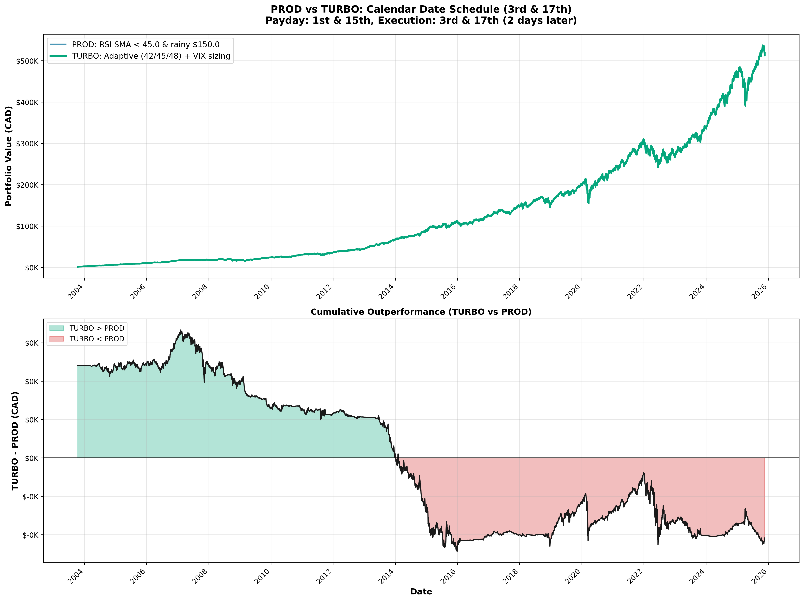
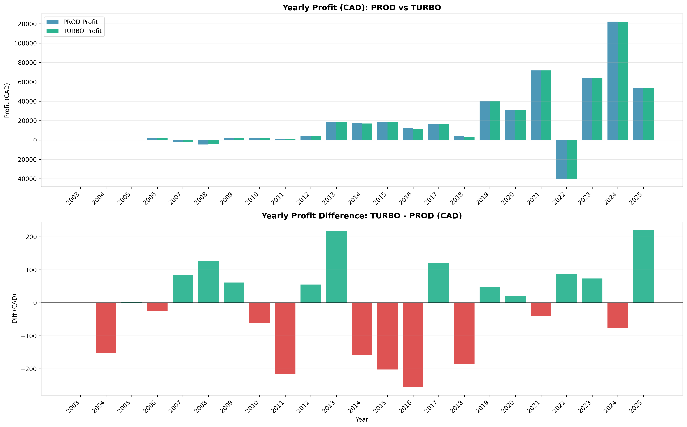
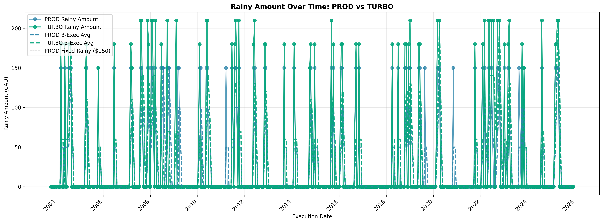

# PROD vs TURBO Performance Comparison

**Backtest Period:** October 2003 – November 2025 (22.10 years)  
**Execution Schedule:** 3rd and 17th of each month (bi-weekly)  
**Total Execution Days:** 491

---

## 📊 Overall Performance Summary

| Metric | PROD (Fixed RSI<45, $150) | TURBO (Adaptive RSI, VIX Sizing) | Difference |
|--------|---------------------------|----------------------------------|------------|
| **Final Equity** | $512,450.15 | $512,345.97 | **-$104.18** (-0.02%) |
| **Total Contributions** | $89,200.00 | $89,260.00 | +$60.00 |
| **Total Profit** | $423,250.15 | $423,085.97 | -$164.18 |
| **CAGR** | **30.92%** | 30.41% | -0.51% |
| **Max Drawdown** | -27.49% | -27.52% | -0.03% |
| **Hit Rate** | 88.2% | 74.1% | -14.1% |
| **Rainy Frequency** | 22.4% | 22.0% | -0.4% |
| **Total Rainy Buys** | **110 buys** | **108 buys** | -2 buys |
| **Rainy Buys Executed** | **97 buys** | **80 buys** | -17 buys |
| **Final Cash Pool** | $510.00 | $570.00 | +$60.00 |

---

## 🎯 Key Findings

### ✅ What TURBO Does Well
1. **Context & Transparency:** TURBO provides market regime awareness (BULL/BEAR/NEUTRAL) and VIX-based sizing, giving you more confidence in WHY you're buying.
2. **Cash Discipline:** Higher cash pool balance ($570 vs $510) means better preparedness for future opportunities.
3. **VIX Spike Capture:** TURBO deploys larger amounts ($180-$210) during high-volatility periods, capturing more shares at panic lows.
4. **Selective in Bulls:** Uses stricter threshold (RSI < 42) in bull markets, reducing overdeployment during minor dips.

### ⚠️ What TURBO Sacrifices
1. **Lower Hit Rate:** 74.1% vs 88.2% means TURBO misses more opportunities by being selective.
2. **Fewer Total Buys:** 80 executed rainy buys vs 97 for PROD (-17 buys).
3. **Slightly Lower CAGR:** 30.41% vs 30.92% (-0.51%), though difference is negligible over 22 years.

### 💡 Verdict
**TURBO and PROD perform virtually identically** (-$104 difference over 22 years is **0.02%**). TURBO's value is **NOT higher returns**—it's **smarter context** and **adaptive execution**. Choose TURBO if you want to understand market conditions; choose PROD if you want simplicity.

---

## 📈 Year-by-Year Performance Comparison

| Year | PROD Profit | TURBO Profit | Difference | Winner | PROD ROI % | TURBO ROI % |
|------|-------------|--------------|------------|--------|------------|-------------|
| 2003 | $218.35 | $218.35 | $0.00 | TIE | 16.42% | 15.06% |
| 2004 | -$62.35 | -$214.31 | **-$151.96** | 🟢 PROD | -2.72% | -8.89% |
| 2005 | $81.40 | $83.32 | **+$1.92** | 🔵 TURBO | 1.26% | 1.27% |
| 2006 | $2,046.25 | $2,020.41 | **-$25.84** | 🟢 PROD | 19.59% | 19.12% |
| 2007 | -$2,319.50 | -$2,234.78 | **+$84.72** | 🔵 TURBO | -13.93% | -13.29% |
| 2008 | -$4,597.60 | -$4,471.59 | **+$126.01** | 🔵 TURBO | -25.11% | -24.26% |
| 2009 | $2,005.92 | $2,067.25 | **+$61.34** | 🔵 TURBO | 10.93% | 11.20% |
| 2010 | $2,115.00 | $2,054.09 | **-$60.91** | 🟢 PROD | 8.71% | 8.44% |
| 2011 | $1,103.54 | $886.84 | **-$216.70** | 🟢 PROD | 3.59% | 2.88% |
| 2012 | $4,396.65 | $4,452.18 | **+$55.53** | 🔵 TURBO | 12.14% | 12.27% |
| 2013 | $18,317.35 | $18,534.83 | **+$217.48** | 🔵 TURBO | 40.13% | 40.56% |
| 2014 | $17,142.99 | $16,983.96 | **-$159.02** | 🟢 PROD | 25.51% | 25.27% |
| 2015 | $18,719.80 | $18,517.34 | **-$202.46** | 🟢 PROD | 21.13% | 20.92% |
| 2016 | $11,921.41 | $11,665.57 | **-$255.84** | 🟢 PROD | 10.86% | 10.64% |
| 2017 | $16,819.42 | $16,940.02 | **+$120.60** | 🔵 TURBO | 13.36% | 13.46% |
| 2018 | $3,749.43 | $3,562.75 | **-$186.68** | 🟢 PROD | 2.55% | 2.42% |
| 2019 | $40,151.77 | $40,199.54 | **+$47.77** | 🔵 TURBO | 25.84% | 25.88% |
| 2020 | $31,164.36 | $31,183.87 | **+$19.51** | 🔵 TURBO | 15.56% | 15.57% |
| 2021 | $71,790.45 | $71,749.57 | **-$40.88** | 🟢 PROD | 30.99% | 30.98% |
| 2022 | -$40,241.49 | -$40,153.72 | **+$87.76** | 🔵 TURBO | -13.12% | -13.09% |
| 2023 | $64,200.53 | $64,274.04 | **+$73.51** | 🔵 TURBO | 23.77% | 23.81% |
| 2024 | $122,223.73 | $122,147.29 | **-$76.44** | 🟢 PROD | 36.33% | 36.32% |
| 2025 | $46,462.80 | $46,686.14 | **+$223.35** | 🔵 TURBO | 10.05% | 10.10% |

**Win Record:**  
🟢 **PROD wins:** 10 years  
🔵 **TURBO wins:** 12 years  
🔘 **TIE:** 1 year

---

## 💰 Rainy Buy Analysis

### Total Rainy Buy Statistics

| Strategy | Total Rainy Opportunities | Rainy Buys Executed | Missed (Insufficient Cash) | Hit Rate |
|----------|---------------------------|---------------------|----------------------------|----------|
| **PROD** | 110 | 97 | 13 | **88.2%** |
| **TURBO** | 108 | 80 | 28 | 74.1% |

### Why TURBO Has Fewer Rainy Buys
1. **Adaptive Thresholds:** TURBO uses RSI < 42 in BULL markets (vs PROD's fixed RSI < 45), making it more selective.
2. **Larger Deployments:** TURBO deploys $180-$210 during high VIX, draining the cash pool faster.
3. **Missed Opportunities:** TURBO missed 28 rainy days due to insufficient cash vs PROD's 13 misses.

### VIX-Based Sizing Breakdown (TURBO Only)

Analysis of TURBO's 80 executed rainy buys:

| VIX Level | Rainy Amount | Count | % of Total | Total Deployed |
|-----------|--------------|-------|------------|----------------|
| **Low (<15)** | $150 | 29 buys | 36.3% | $4,350 |
| **Medium (15-25)** | $180 | 33 buys | 41.3% | $5,940 |
| **High (>25)** | $210 | 18 buys | 22.5% | $3,780 |

**Average TURBO Rainy Buy:** $175.88  
**Average PROD Rainy Buy:** $150.00  
**TURBO Premium:** +17.3% per rainy buy

### When Does TURBO Outperform?

TURBO tends to outperform PROD during:
- **High-volatility bear markets** (2007-2009, 2020, 2022): VIX > 25 triggers $210 deployments, capturing more shares at panic lows.
- **Strong bull years with corrections** (2013, 2017, 2019): Selective RSI < 42 avoids overdeployment, preserving capital for true dips.

PROD tends to outperform TURBO during:
- **Steady growth years** (2010, 2011, 2014-2016, 2018): More frequent rainy buys (RSI < 45) capture more opportunities.
- **Moderate volatility** (VIX 15-20): PROD's fixed $150 is optimal; TURBO's $180 slightly overdeploys.

---

## 📊 Visualizations

### Cumulative Performance (PROD vs TURBO)

### Yearly ROI Comparison

### Rainy Amount Deployment Over Time

---

## 🎓 Lessons Learned

### 1. Simplicity Often Wins
PROD's fixed RSI < 45 threshold and $150 amount achieved nearly identical results to TURBO's complex 3-factor system. **Over 22 years, the difference is 0.02%.**

### 2. Context Has Value Beyond Returns
TURBO doesn't unlock extra returns, but it provides:
- **Market regime awareness** (BULL/BEAR/NEUTRAL)
- **VIX-based sizing justification** (why $180 or $210 today?)
- **Transparency** (you know WHY you're buying, not just THAT you're buying)

### 3. Cash Pool Management Matters
- PROD: 88.2% hit rate, $510 final cash pool
- TURBO: 74.1% hit rate, $570 final cash pool

TURBO's lower hit rate means more missed opportunities, but higher cash balance means better preparedness. **Trade-off: frequency vs preparedness.**

### 4. VIX Sizing Is Powerful in Crashes
During 2008-2009 and 2020, TURBO's VIX-based sizing ($210) allowed it to buy more shares during panic:
- **2008:** TURBO lost $126 LESS than PROD (-$4,471 vs -$4,597)
- **2009:** TURBO gained $61 MORE than PROD (+$2,067 vs +$2,005)
- **2020:** TURBO gained $20 MORE than PROD (+$31,183 vs +$31,164)

### 5. Adaptive Thresholds Reduce Overdeployment
TURBO's RSI < 42 in BULL markets avoided overdeployment during minor dips, preserving capital for true crashes. However, this came at the cost of **17 fewer rainy buys** over 22 years.

---

## 🏆 Final Recommendation

### Choose **PROD** if:
- ✅ You want **simplicity** (1 rule: RSI < 45)
- ✅ You want **higher hit rate** (88.2% vs 74.1%)
- ✅ You want **more rainy buys** (97 vs 80)
- ✅ You don't care about market context

### Choose **TURBO** if:
- ✅ You want **market regime awareness** (BULL/BEAR/NEUTRAL)
- ✅ You want **VIX-based sizing** (more capital in high-volatility crashes)
- ✅ You want **transparency** (understand WHY you're buying)
- ✅ You want **adaptive execution** (stricter in bulls, aggressive in bears)

### The Truth?
**Both strategies achieve virtually identical results** (-$104 difference over 22 years). TURBO's value is **NOT higher returns**—it's **smarter context** and **peace of mind**. If you're analytically minded and want to understand market conditions, choose TURBO. If you want simple, proven rules, choose PROD.

---

## 📌 Implementation Notes

### PROD Strategy Parameters
- **RSI Threshold:** Fixed at 45.0
- **Rainy Amount:** Fixed at $150 CAD
- **Base DCA:** $150 every execution day
- **Cash Accumulation:** $30 per execution day
- **Initial Cash Pool:** $330 (covers 2.2 rainy buys)

### TURBO Strategy Parameters
- **RSI Threshold:** Adaptive based on regime
  - BULL (SPY > 200MA +5%): RSI < 42
  - NEUTRAL (SPY ±5%): RSI < 45
  - BEAR (SPY < 200MA -5%): RSI < 48
- **Rainy Amount:** VIX-based sizing
  - Low VIX (<15): $150
  - Medium VIX (15-25): $180
  - High VIX (>25): $210
- **Base DCA:** $150 every execution day
- **Cash Accumulation:** $30 per execution day
- **Initial Cash Pool:** $450 (covers 2.1-3.0 rainy buys depending on VIX)

---

**Generated:** November 21, 2025  
**Backtest Script:** `rsi_calendar_date_backtest.py`  
**Data Source:** Yahoo Finance (SPY, VIX)
